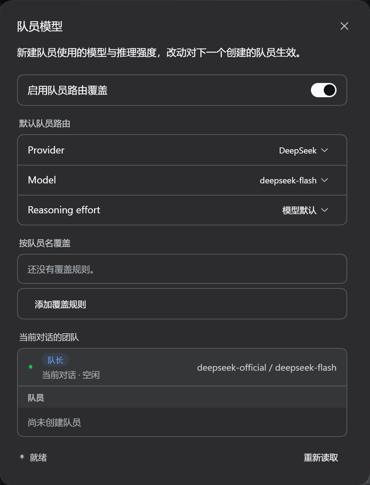
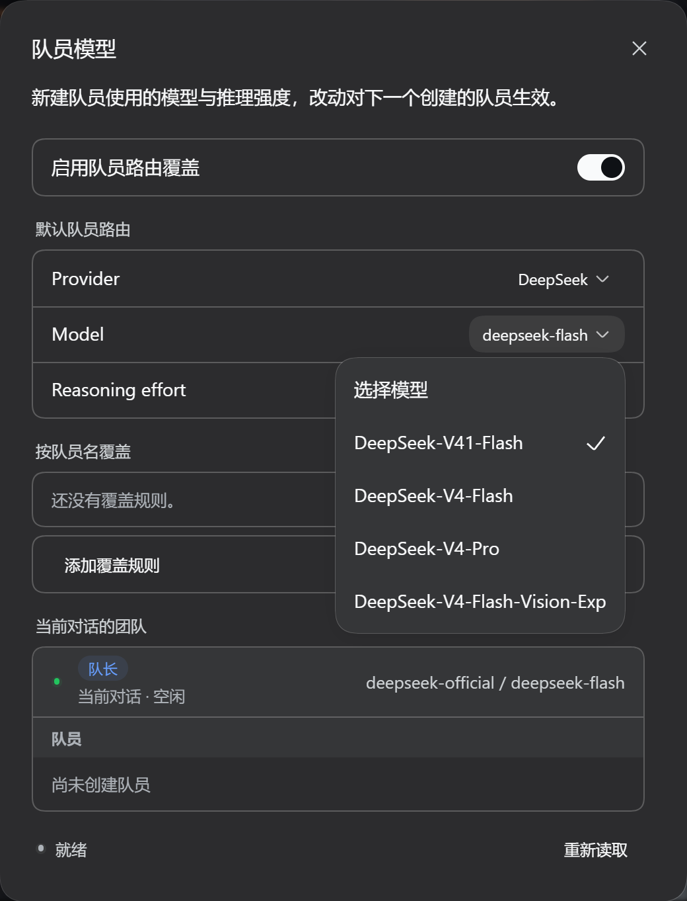
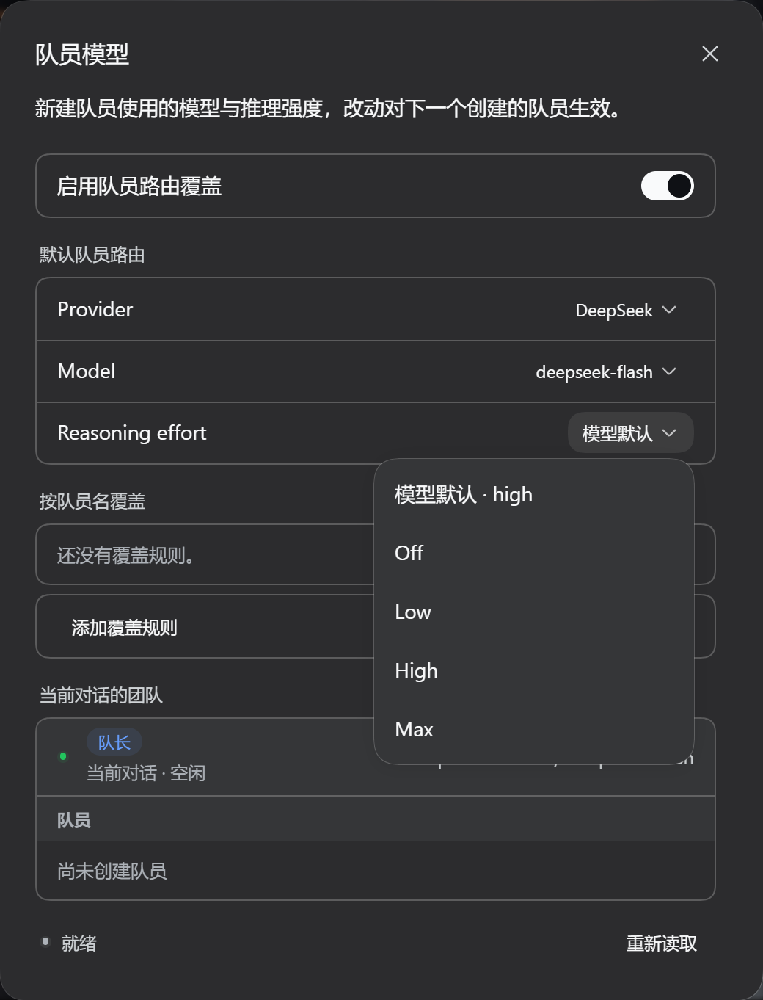

# dsh-agent-team-model

为 DeepSeek Harness Agent Teams 提供可视化的队员模型配置：按默认规则或队员名选择 provider、model 和 reasoning effort，并在当前会话中查看团队状态与每个队员实际使用的路由。

> 当前版本：`0.3.2`
>
> 已验证 DSH：`0.1.5-alpha.2`
>
> 仅影响**新创建**的队员；已存在的队员不会被热切换模型。

## 前置依赖（必读）

本插件**只负责配置队员的路由**，队员本身由 DeepSeek Harness 官方的实验性 Agent Teams 层提供。它不是一个独立功能：**只用本插件、不装上级插件，是装不出队员的**。

| 依赖 | 必须 | 说明 |
|---|---|---|
| DeepSeek Harness（`@deepseek-ai/dsh-*`，含 `dsh-base`） | ✅ | 已验证 `0.1.5-alpha.2`；兼容范围见 `package.json` 的 `engines.dsh` |
| **官方 Agent Teams 层** `@deepseek-ai/dsh-experimental-agent-team-profile` | ✅ | 提供 `ctx.agentTeams`，以及 `spawn_teammate` / `send_message` / `list_agents` / `wait_agent` / `interrupt_agent` 等 Team 工具 |
| Web profile（`dsh web`，或桌面客户端使用的 profile） | ✅ | 宿主半边要注册 `/agent-team-model/api`，需要该 profile 提供 `webServer` 与 `webRuntime`；headless / SDK / ACP profile 不会激活本插件 |
| 至少一个可用的 provider / model | ✅ | Provider、Model 下拉读的是宿主当前的模型目录 |

> ⚠️ **DSH 随附的 profile 默认都不启用 Agent Teams**，第 2 项必须显式添加（上游包自己的说明也是这样要求的）。只装本插件时宿主会返回 `hook.agentTeams: false`，界面会提示「未检测到官方 Agent Teams 上层插件」并给出要装的包名。

## 安装

```sh
# 1) 上级依赖：官方 Agent Teams 层（必装，DSH 默认不启用）
dsh plugin --profile web add @deepseek-ai/dsh-experimental-agent-team-profile

# 2) 本插件
dsh plugin --profile web add github:XMeowchan/dsh-agent-team-model
```

然后**重启 DSH**（宿主半边要重新组 profile），再刷新页面。桌面客户端请把 `web` 换成实际 profile 名——profile 目录在 `$DSH_HOME/profiles/`（Windows 默认 `C:\Users\<你>\.dsh\profiles\`）。

**验证两层都装好了**：重启后打开 **设置 → 队员模型**；或直接调用宿主诊断接口：

```sh
curl -s -X POST http://127.0.0.1:3080/agent-team-model/api \
  -H 'content-type: application/json' -d '{"method":"get"}'
```

返回值的 `hook` 字段是自检结果：`subagents`、`agentTeams`、`installed` **三者都为 `true`** 才算完整。

- `agentTeams: false` → 第 1 步没装，或没被加进 profile 的 `dsh.profile.bundles`；
- `installed: false` 而 `agentTeams: true` → 宿主没重启。

**卸载**（顺序不限，建议先移除本插件）：

```sh
dsh plugin --profile web remove dsh-agent-team-model
dsh plugin --profile web remove @deepseek-ai/dsh-experimental-agent-team-profile
```

### 给 AI Agent 的安装清单

把本仓库交给 AI 让它安装时，请按下面顺序执行，不要跳过第 1 步：

1. 确认目标 profile 是 Web profile：`$DSH_HOME/profiles/<profile>/package.json` 的 `dsh.profile.bundles` 里应有 `@deepseek-ai/dsh-web-app`（或 `@deepseek-ai/dsh-web`）；headless / SDK / ACP profile 装了也不会激活；
2. `dsh plugin --profile <profile> add @deepseek-ai/dsh-experimental-agent-team-profile` —— **上级依赖，必装**；
3. `dsh plugin --profile <profile> add github:XMeowchan/dsh-agent-team-model` —— 本插件；
4. 重启 DSH，刷新 Web 页面；
5. 用上面的 `POST /agent-team-model/api` 校验 `hook.subagents`、`hook.agentTeams`、`hook.installed` 是否都为 `true`；
6. 若 `agentTeams` 为 `false`，回到第 2 步——不要试图用本插件替代 Team 层，它只写路由。

## 功能

- 在设置页或输入框旁的队员按钮中配置默认队员路由。
- 支持按 `spawn_teammate` 的队员名精确覆盖。
- 调用方显式传入 provider/model 时，显式参数优先。
- 显示当前对话的队长、队员、运行状态与实际路由。
- 重启后从队员持久化描述符恢复路由视图，不会唤醒队员。
- 队员自己的会话只显示自身信息，并保持只读；不会暴露队长配置或其他队员。
- 配置保存在 `$DSH_HOME/agent-team-model.json`，下一次创建队员时生效。

## 界面截图

**队员模型面板**——启用开关、默认队员路由、按队员名覆盖，以及当前对话的团队。



**选择模型**——模型列表来自宿主当前的 provider 目录。



**选择推理强度**——「模型默认」让所选模型使用自己的默认值，而不是沿用队长的强度；Provider 选「继承队长」则完全不注入路由。



## 使用

1. 打开 **设置 → 队员模型**，或点击输入框旁的队员按钮。
2. 打开启用开关。
3. 选择默认 provider、model 和 reasoning effort。
4. 如需特殊规则，添加队员名并选择单独路由。
5. 之后创建的新队员会使用对应规则。

选择“模型默认”时，插件会让所选模型使用自己的默认 reasoning effort，而不是沿用队长的 effort。Provider 选择“继承队长”则不注入路由。

也可以在 `dsh-market` 里搜索安装（市场条目合并后可用）。

## 配置文件

```json
{
  "enabled": true,
  "default": {
    "provider": "deepseek-official",
    "model": "deepseek-flash",
    "reasoningEffort": "high"
  },
  "overrides": {
    "researcher": {
      "provider": "deepseek-official",
      "model": "deepseek-flash"
    }
  }
}
```

- `enabled: false`：完全继承队长路由。
- `default`：没有专门规则的队员使用的路由。
- `overrides[队员名]`：按队员名精确匹配。
- 缺少 provider 或 model：不注入，继承队长。
- 缺少 reasoning effort：使用所选模型的默认值。

## 工作原理与兼容性

插件在 Agent Teams 创建 continuable 队员时识别对应 roster 成员，并向 DSH 已有的 `ctx.subagents.startContinuable` 请求注入 `agentOptions`。普通 `subagent` 委派不受影响。

它依赖 DSH 的 Agent Teams、Subagents、Session Query 和 Web UI 接口；其中 Agent Teams 来自上级插件 `@deepseek-ai/dsh-experimental-agent-team-profile`（见[前置依赖](#前置依赖必读)），本插件不替代它，也不修改它。当前发布版针对 DSH `0.1.5-alpha.2` 验证；升级 DSH 后建议重新运行测试。宿主半边 `lib/index.js` 的改动需要重启 DSH，浏览器半边刷新页面即可重新加载。

本插件的本地 HTTP 配置接口只接受 loopback 或宿主显式信任的 authority，并拒绝跨站请求。它是本机配置接口，不是多用户身份认证系统。

## 开发与测试

无需第三方运行时依赖。基础检查与宿主测试：

```sh
npm test
```

UI 回归测试依赖 React、React DOM、jsdom 和 `@deepseek-ai/dsh-client-ui-primitives`。将 `ATM_TEST_MODULES` 指向装有这些包的目录：

```powershell
$env:ATM_TEST_MODULES = 'C:\path\to\ui-test-modules'
npm run test:ui
```

打包内容预览：

```sh
npm pack --dry-run
```

## 已知边界

- 只改变新建队员的路由；要改变已有队员需重新创建。
- 队员的工具集仍跟随队长 preset；插件只改变 LLM 路由。
- 未运行队员的路由视图依赖 DSH 当前的持久化 descriptor 格式。
- UI 每 4 秒刷新一次当前会话团队；标签页隐藏时跳过轮询。

## License

[MIT](LICENSE) © 2026 XMeow
